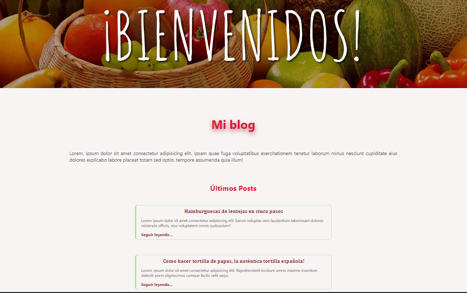

______________________________________________________________________________________________________________
# Introducción a Frontend
______________________________________________________________________________________________________________

## Ejercicio 2 Módulo 2. Diseño Resposivo.

### Practicando el uso de Git, Github
***Subiendo un repositorio por primera vez.*** 

